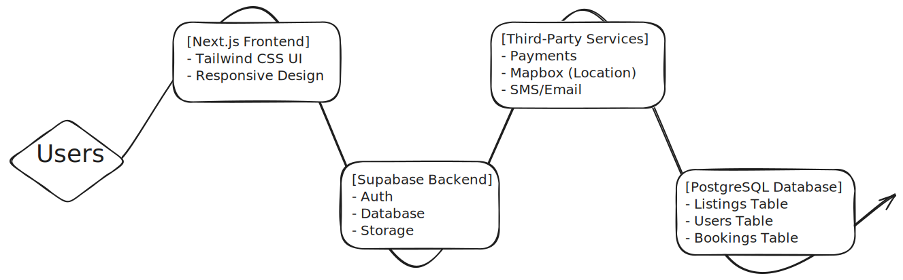

# 1. HabitatHub - Universal Accommodation Platform
**Version:** Alpha 0.1 | **Last Updated:** [22-May-2025]

---
## 2. Team Members
| Name          | Role                | Portfolio | Repository |
|---------------|---------------------|-----------|------------|
| Pravin Kumar  | Full Stack         | [Link](https://vins-portfolio-two.vercel.app/)    | [Link](https://github.com/Pravin-hub-rgb?tab=repositories)     |

---

## 3. Table of Contents
1. [Executive Summary](#4-executive-summary)
2. [The Five Ws](#5-the-five-ws)
3. [Project Vision](#6-project-vision)
4. [Market Analysis](#7-market-analysis)
5. [Business Model](#8-business-model)

---

## 4. Executive Summary
HabitatHub is a unified platform for all accommodation needs - renting, buying, selling, couchsurfing, homestays, PGs, and Dharamshalas. Our simple yet powerful solution offers:

- Single platform for all accommodation types
- Real-time listing updates
- User-friendly interface
- Secure booking system

---

## 5. The Five Ws

### 5.1 What is the Project?
**Core Features:**
- Multi-category listings
- Advanced search filters
- User verification system
- Booking management
- Review system

**Tech Stack:**
- **Frontend:** Next.js 15, Tailwind CSS
- **Backend:** Supabase
- **Database:** Supabase PostgreSQL
- **Hosting:** Vercel

### 5.2 Why is the Project Important?
**Problem Solved:**
- Fragmented accommodation markets
- Time-consuming search process
- Lack of standardized verification

**Unique Value:**
One platform for all accommodation needs

### 5.3 Who is it For?
**Users:**
- Students
- Travelers
- Home seekers
- Property owners

### 5.4 When Will it Be Available?
**Timeline:**
- Coming soon...

### 5.5 Where Will it Be Used?
**Platforms:**
- Web
- Mobile (Future)

**Markets:**  
[Primary geographic markets]

### 5.6 How Does it Work?
**Basic Flow:**
1. User selects accommodation type
2. Filters listings by preferences
3. Views property details
4. Books/Contacts through platform

**Architecture**

---

## 6. Project Vision
- Long Term: Become the go-to platform for global accommodation needs
- Short-term Goals:
    - Launch core features
    - Establish partner network
    - User acquisition

---

## 7. Market Analysis

### Target Market Size & Segments
**Total Addressable Market:**  
₹65 lakh crore (Indian real estate + hospitality market - Knight Frank 2023)

**Key Segments:**  
- Urban renters (37% of Indian households - NSO 2021)  
- Student housing seekers (4.3 crore enrolled in higher education - AISHE 2022)  
- Religious travelers (14 lakh daily Dharamshala visitors - MoT 2023)  
- Remote workers (8.5 million Indian professionals - Awfis 2023)  

### Competitor Analysis
| Competitor       | Strength          | Weakness vs HabitatHub       |
|------------------|-------------------|------------------------------|
| Nestaway         | Co-living focus   | No buying/selling features    |
| NoBroker         | Rental dominance  | Limited to long-term stays    |
| OYO Rooms        | Budget stays      | No PG/Dharamshala options     |
| MakeMyTrip       | Pilgrimage trips  | No residential properties     |

**Key Advantage:**  
HabitatHub combines 7+ accommodation types vs competitors' average of 2-3

### SWOT Analysis
| **Strengths**         | **Weaknesses**        |
|-----------------------|-----------------------|
| First pan-India multi-category platform | High user acquisition costs |
| Local language support (12 Indian languages) | Requires hyperlocal partnerships |
| RBI-compliant payment solutions |                       |

| **Opportunities**      | **Threats**           |
|-----------------------|-----------------------|
| 53% urban housing shortage (World Bank) | State-specific rental laws |
| 300% growth in co-living (2020-25)      | Deep-pocketed proptech startups |
| PM Awas Yojana integration potential | Economic slowdown impacts |

### Market Trends & Opportunities
**Current Trends:**  
1. 17% CAGR in co-living sector (2023-28 - Mordor Intelligence)  
2. 22% of PropTech investments in residential segment (2023 - Venture Intelligence)  
3. 68% millennials prefer flexible leases (Magicbricks 2023 Survey)  

**Emerging Opportunities:**  
- Partner with PMAY-U (Urban) for affordable housing  
- Integrate with IRCTC for pilgrimage stays  
- Offer PG insurance packages with ICICI Lombard  
- Subscription models for student housing (semester-based)  
- Vernacular interface for tier-2/3 cities  

---

## 8. Business Model

### Revenue Streams
**1. Transaction Fees**  
- 1.5% commission on rentals (vs 2% industry avg)  
- 5% fee on PG/Homestay bookings  
- ₹999 fixed fee for property sales  

**2. Premium Listings**  
- ₹299/day boost for top search visibility  
- ₹1499/month verified badge for landlords  

**3. Subscription Plans**  
| Plan          | Price (Monthly) | Features                  |
|---------------|-----------------|---------------------------|
| Student Pass  | ₹99             | Unlimited PG searches     |
| Pilgrim Pro   | ₹199            | Dharamshala priority access |
| Investor Plus | ₹4999           | Off-market property alerts |

**4. Value-Added Services**  
- ₹499 background verification (Aadhaar-based)  
- ₹2999 virtual tour creation service  
- Commission from partner services (packers/movers, interior designers)  

### Pricing Strategy
**Core Principles:**  
- **Tiered Pricing:** Different rates for metros (Mumbai/Delhi) vs tier-2 cities  
- **Dynamic Pricing:** 20% surge during peak seasons (college admissions, pilgrimage months)  
- **Anchor Pricing:** Free basic listings to attract first-time users  

**Price Comparison:**  
| Service          | HabitatHub | Competitor   |
|------------------|------------|--------------|
| Rental Agreement | ₹299       | NoBroker ₹500 |
| PG Listing       | Free       | Nestaway ₹999 |

### Customer Acquisition Strategy
**Digital Channels:**  
- WhatsApp Business API for tier-2/3 cities  
- Instagram Reels campaigns targeting students  
- Google Ads in Hindi/Regional languages  

**Offline Channels:**  
- College campus ambassadors (₹50/lead bonus)  
- Railway station kiosks during pilgrimage seasons  
- Partnership with ICICI Bank branches for co-branded offers  

**Growth Hacks:**  
- ₹200 referral cashback (both referrer & referee)  
- Free legal consultation for first 100 property sellers  
- "PG Finder" chatbot on Telegram  

### Cost Structure
**Fixed Costs (Monthly):**  
- Tech Infrastructure: ₹8.5 lakh (AWS India servers)  
- Compliance: ₹2 lakh (state-specific rental laws)  
- Office Spaces: ₹3 lakh (Delhi+Mumbai hubs)  

**Variable Costs:**  
- Customer Acquisition: ₹150-₹300 per urban user  
- Verification Services: ₹75/background check  
- UPI Transaction Fees: 0.5-1% per payment  

**Cost Optimization:**  
- Use Aadhaar API for low-cost KYC (₹5/verification)  
- Vernacular content creation via AI tools  
- Shared warehouse spaces for document storage  

### Key Partnerships
| Partner Type       | Examples                  | Value Add                                  |
|--------------------|---------------------------|--------------------------------------------|
| Verification       | Aadhaar, CRED            | Trusted identity checks                    |
| Payments          | UPI, Paytm, Razorpay     | Localized payment solutions                |
| Real Estate       | Magicbricks, 99acres     | Property listing syndication               |
| Government        | PMAY, Smart City Mission | Affordable housing integration             |
| Logistics         | Porter, Urban Company    | Move-in/move-out services                  |
| Religious         | IRCTC, Yatra.com         | Pilgrimage package bundling                |

**Strategic Alliance Example:**  
**Tie-up with State Transport:**  
- Offer ₹500 travel voucher with Maharashtra ST buses  
- Integrated bookings for Uttarakhand Char Dham yatra  